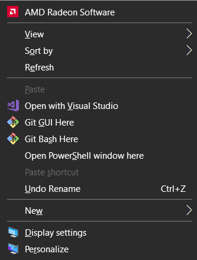
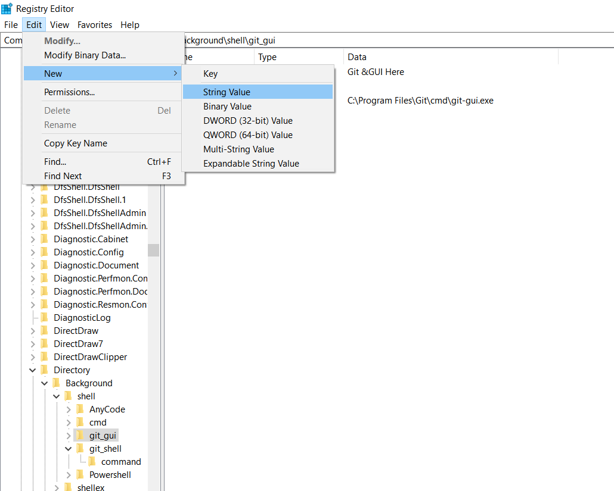

# How_to_Remove_Git_from_Context_Menu
I will help you to remove 'Git GUI here' &amp; 'Git Bash here' options from context menu or to move it to extended context menu (ctrl + shift + right-click) using Windows 10 Registry Editor




Using the Windows Registry editor delete the following two keys:

```
HKEY_CLASSES_ROOT\Directory\Background\shell\git_gui
HKEY_CLASSES_ROOT\Directory\Background\shell\git_shell
```

This will remove the two options from your Context Menu.

<br>

-----

<br>


If you don't want to delete it and feels it being useful sometimes but don't want it to clutter up the context menu, you can move it to the extended context menu (where it is only visible with ctrl+shift+right-click).

Using the Windows Registry editor, add a new string value under each of the following keys, with the name "Extended":

```
HKEY_CLASSES_ROOT\Directory\Background\shell\git_gui
HKEY_CLASSES_ROOT\Directory\Background\shell\git_shell
```

* Click 'Edit' on the top left corner of the Window
* New
* String Value
* Name the new string value "Extended"



You can use these methods to move almost any Context Menu options by Editing/Deleting their respective Registry Keys.